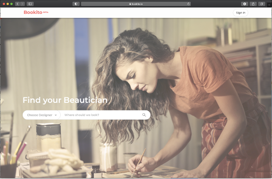
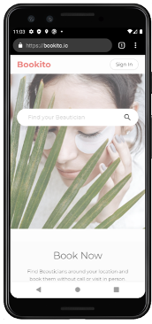

# <a href="https://bookito.io/">Bookito.io</a>

Bookito is an web app that connects beauticians to new clients.
Beauticians such as hairdressers or nail artists can simply register to create a profile visible to Booktio users. Users can browse and discover beauticians around their location and book an appointment online without the inconvenience of calling or visiting.

Additional features such as schedule calendar and real time messaging are offered to registered beauticians. 

## Technology
Bookito is a React/Redux based single page application.
Redux in complement with Redux-Persist is used for state management.

SCSS and its Mixin feature is used for responsive, mobile-first design.

Google Maps API & Geocoding is used to provide address to latitude/longitude translation for map based browsing of local beautician in proximity to user.

Firebase as backend is used in various capacities. Firebase Authentication is used for login handling, Realtime-Database for messenger feature, Storage for images, Firestore for various user and appointment data, and Firebase Email Trigger Extension is used to send email notifications.

UI/UX was prototyped using Figma. 

## Gallary

## To Start

To run the app in development mode, `npm start`.

Open [http://localhost:3000](http://localhost:3000) to view it in the browser.

## Credits
Kangmin Jayce Lee   - Project Manager & Developer

Joshau Shin         - Developer

Heeja Erica Jeong   - Developer

Gina Kim            - Developer

Yongju Kwon         - Developer

Jaewhee Seo         - Developer

 

##### May 2020 - Jan 2021
